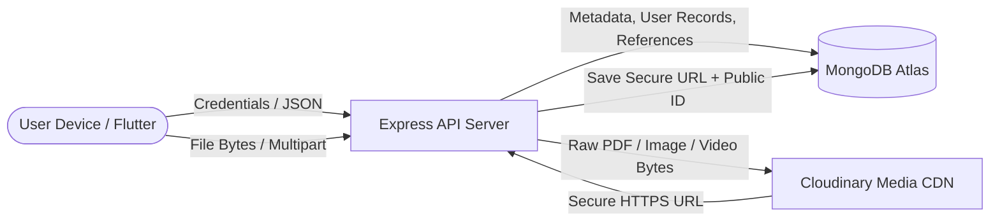

# 🎓 EduShare — Complete Project & Viva Defense Technical Guide

This document is a comprehensive technical guide for the **EduShare** application. It details the complete architecture, tech stack, database choice, API design, file storage pipelines, authentication workflows, and answers every technical question you might encounter during your **Viva Voce / Final Year Project Defense**.

---

## 📑 Table of Contents
1. [Project Overview & Problem Statement](#1-project-overview--problem-statement)
2. [Complete Technology Stack](#2-complete-technology-stack)
3. [Database Architecture: SQL vs. NoSQL](#3-database-architecture-sql-vs-nosql)
4. [Where & How Every Piece of Data is Stored](#4-where--how-every-piece-of-data-is-stored)
5. [REST API Architecture & HTTP Methods](#5-rest-api-architecture--http-methods)
6. [Step-by-Step Data Flow & Lifecycle](#6-step-by-step-data-flow--lifecycle)
7. [Authentication, Security & Role-Based Access (RBAC)](#7-authentication-security--role-based-access-rbac)
8. [Advanced Subsystems (Video Learning, Rating, Approvals)](#8-advanced-subsystems)
9. [Comprehensive Viva Questions & Corner-Case Q&A](#9-comprehensive-viva-questions--corner-case-qa)

---

## 1. Project Overview & Problem Statement

**EduShare** is a centralized, department-scoped university resource and collaborative learning platform. 

### Key Problems Solved:
- **Scattered Resources**: Eliminates fragmented academic materials distributed across Facebook groups, Google Drives, and messaging channels.
- **Quality Control**: Enforces a strict **Department-Admin Approval Workflow** where only verified faculty-approved materials become accessible to students.
- **Multimedia Learning**: Provides in-app video lectures, watch history, resume-playback, and PDF/image reading.
- **Departmental Isolation**: CSE students and admins only interact with CSE resources, while maintaining a unified Super Admin governance mechanism.

---

## 2. Complete Technology Stack

| Layer | Technology | Purpose / Justification |
| :--- | :--- | :--- |
| **Mobile Frontend** | **Flutter (Dart 3.x)** | Cross-platform native mobile performance (Android release build compiled via AOT). |
| **State Management** | **Provider (ChangeNotifier)** | Reactive, clean separation of UI and business logic without excessive boilerplate. |
| **Backend Runtime** | **Node.js (v18+)** | Non-blocking, asynchronous event-driven I/O ideal for concurrent API requests and file streaming. |
| **Backend Framework** | **Express.js** | Fast, minimalist REST API routing, middleware chaining, and centralized error handling. |
| **Primary Database** | **MongoDB Atlas (NoSQL)** | Cloud-hosted document database for metadata, users, courses, materials, ratings, and video progress. |
| **Database ODM** | **Mongoose** | Schema validation, type casting, pre-save middleware (e.g. bcrypt password hashing), and indexing. |
| **Media Cloud Storage** | **Cloudinary (CDN)** | High-speed cloud storage, streaming, and CDN delivery for PDFs, images, and raw video files. |
| **File Processing** | **Multer (MemoryStorage) + Streamifier** | In-memory multipart buffer processing that streams directly to Cloudinary without writing to server disk. |
| **Authentication** | **JWT (JSON Web Tokens) + bcryptjs** | Stateless token-based security with 12-round cryptographic password hashing. |
| **Backend Deployment** | **Render Cloud Platform** | Automated CI/CD deployment linked to GitHub `main` branch. |

---

## 3. Database Architecture: SQL vs. NoSQL

### Why NoSQL (MongoDB) was Chosen over Relational SQL (MySQL/PostgreSQL):

```
                   ┌────────────────────────────────────────────────┐
                   │               MongoDB (NoSQL)                  │
                   └──────────────────────┬─────────────────────────┘
                                          │
       ┌──────────────────────────────────┼─────────────────────────────────┐
       ▼                                  ▼                                 ▼
┌──────────────┐                  ┌──────────────┐                  ┌──────────────┐
│  Polymorphic │                  │   Document   │                  │  Horizontal  │
│  Materials   │                  │  Embedding   │                  │  Scalability │
└──────────────┘                  └──────────────┘                  └──────────────┘
(PDFs, Notes, Videos              (Video progress,                  (High throughput
 have flexible fields)             ratings, comments)                cloud cluster)
```

1. **Polymorphic Data Structures**:
   - Academic materials vary significantly by type:
     - A **Video** material requires: `videoSource`, `videoLink`, `duration`, `views`.
     - A **PDF/Document** requires: `fileUrl`, `fileName`, `fileSize`, `filePublicId`.
   - In SQL, this requires either a table with numerous `NULL` columns or complex multi-table `JOIN` operations (Single Table Inheritance vs. Class Table Inheritance). In MongoDB, a single flexible schema natively handles both.
2. **JSON/BSON Natural Mapping**:
   - Modern mobile development (Dart/Flutter) communicates via JSON. MongoDB stores documents in BSON (Binary JSON). This eliminates the **Object-Relational Impedance Mismatch**.
3. **High Read-to-Write Ratio & Embedding**:
   - University portals have high read traffic. MongoDB indexes (`courseId`, `departmentId`, `approvalStatus`) provide $O(\log N)$ fast reads.
4. **Cloud Scalability**:
   - MongoDB Atlas provides instant replicas, automated backups, and sharding capabilities.

---

## 4. Where & How Every Piece of Data is Stored

### Detailed Storage Map:



### 1. New Account Registrations (`users` collection in MongoDB Atlas)
- **What is stored**: Name, University Email, Role (`student`, `contributor`, `faculty_admin`, `super_admin`), Status (`active`, `pending`, `rejected`, `disabled`), Department name, `departmentId` (ObjectId reference), Student ID (students only), Faculty ID & Designation (admins only), Profile Photo URL.
- **Passwords**: Hashed with **`bcryptjs` (salt rounds = 12)**. The plain password is never saved and excluded from JSON responses (`select: false`).
- **Account Approval State**:
  - `student`: Created as `active` immediately $\rightarrow$ returns JWT.
  - `contributor`: Created as `pending` $\rightarrow$ awaits Faculty Admin approval $\rightarrow$ no JWT issued until approved.
  - `faculty_admin` (Admin): Created as `pending` $\rightarrow$ awaits Super Admin approval $\rightarrow$ no JWT issued until approved.

### 2. Video Files (`Cloudinary` + `MongoDB Atlas`)
- **Direct Video Upload**: File bytes stream through Multer to **Cloudinary** (`resource_type: 'video'`). Cloudinary generates a fast-streaming HTTPS CDN URL.
- **MongoDB Record**: Stores `videoSource: 'cloudinary'`, `fileUrl: 'https://res.cloudinary.com/...'`, `videoLink: null`, and `courseId`.
- **YouTube / Drive Link**: If the contributor supplies an external link, no media file is uploaded to Cloudinary. Stored directly in MongoDB as `videoSource: 'youtube'`, `videoLink: 'https://youtube.com/...'`.

### 3. PDF Notes & Images (`Cloudinary` + `MongoDB Atlas`)
- **Storage Location**: **Cloudinary** storage under folder `edushare/materials`.
- **MongoDB Record**: Stores `fileUrl`, `filePublicId` (used for deleting the asset from Cloudinary when material is removed), `fileName`, and `fileSize` (in bytes).

### 4. Video Watch Progress & Continue Watching (`videoprogresses` collection)
- **What is stored**: `userId`, `materialId`, `courseId`, `lastPosition` (in seconds), `duration` (in seconds), `completed` (boolean), `lastWatched` (timestamp).
- **How Continue Watching works**: When a student opens the Home screen, `GET /api/videos/continue-watching` queries `VideoProgress.find({ userId: req.user._id, completed: false }).populate('materialId')`.

### 5. Bookmarks (`bookmarks` collection in MongoDB)
- **What is stored**: `userId`, `materialId`, `courseId`, and timestamp. Fast indexing on `{ userId: 1, materialId: 1 }` prevents duplicate bookmarks.

### 6. Ratings & Reviews (`materialratings` and `ratings` collections)
- **Per-Material Rating**: Students submit 1–5 stars + optional text. When submitted, Mongoose recalculates and denormalizes `avgRating` and `totalRatings` directly onto the `Material` document for instantaneous reading without aggregation joins.

---

## 5. REST API Architecture & HTTP Methods

EduShare uses **RESTful API conventions**. All requests communicate over HTTPS with JSON envelopes or `multipart/form-data`.

```json
{
  "success": true,
  "data": { ... },
  "message": "Operation completed successfully"
}
```

### Complete Endpoint Reference:

#### Authentication & Profiles (`/api/auth`)
- `POST /api/auth/register` — Register student/contributor/faculty_admin (`POST` creates resource).
- `POST /api/auth/login` — Authenticate and receive JWT token.
- `GET  /api/auth/profile` — Fetch currently authenticated user's profile (`GET` reads resource).
- `PUT  /api/auth/profile` — Update name, bio, designation (`PUT` updates resource).

#### Departments (`/api/departments`)
- `GET  /api/departments` — **Public endpoint** (no auth required). Returns only `isActive: true` departments for registration dropdowns.
- `GET  /api/departments/all` — Super Admin only: returns all departments including inactive ones.
- `POST /api/departments` — Super Admin only: creates a new department.
- `PUT  /api/departments/:id` — Super Admin only: updates name, code, description.
- `PUT  /api/departments/:id/activate` — Super Admin only: activates department.
- `PUT  /api/departments/:id/deactivate` — Super Admin only: hides department from public signup.
- `DELETE /api/departments/:id` — Super Admin only: permanently removes department.

#### Courses (`/api/courses`)
- `GET  /api/courses?departmentId=...&status=active` — Fetch active courses for students/contributors.
- `GET  /api/courses?departmentId=...&includeAll=true` — Admin view of all courses.
- `POST /api/courses` — Faculty Admin / Super Admin creates a course.
- `PUT  /api/courses/:id` — Update course details.
- `PATCH /api/courses/:id/status` — Toggle course active/inactive.
- `DELETE /api/courses/:id` — Delete course.

#### Materials (`/api/materials`)
- `GET  /api/materials?courseId=...&type=...` — Browse approved materials for a course.
- `GET  /api/materials/my` — Contributor fetches their own upload history.
- `POST /api/materials` — Multipart upload (`file`, `title`, `description`, `type`, `courseId`, `departmentId`).
- `DELETE /api/materials/:id` — Delete material (also deletes binary file from Cloudinary via `filePublicId`).

#### Admin Review & Approvals (`/api/admin`)
- `GET /api/admin/pending` — Fetch materials pending approval in Admin's department.
- `PUT /api/admin/approve/:id` — Approve material and notify contributor and students.
- `PUT /api/admin/reject/:id` — Reject material with reason.
- `GET /api/admin/pending-contributors` — Fetch pending contributors in Admin's department.
- `PUT /api/admin/contributors/:id/approve` — Approve contributor account.
- `PUT /api/admin/contributors/:id/reject` — Reject contributor registration.

#### Super Admin Console (`/api/super-admin`)
- `GET /api/super-admin/stats` — System-wide analytics (user counts, material counts).
- `GET /api/super-admin/faculty-admins/pending` — Admins awaiting approval.
- `PUT /api/super-admin/faculty-admins/:id/approve` — Approve Admin account.
- `PUT /api/super-admin/faculty-admins/:id/disable` — Suspend Admin account.
- `PUT /api/super-admin/faculty-admins/:id/enable` — Re-enable Admin account.

---

## 6. Step-by-Step Data Flow & Lifecycle

### A. Lifecycle of a Material Upload & Approval Flow

```
[Contributor] 
      │ 1. Selects PDF/Video & fills details
      ▼
[Flutter Client] 
      │ 2. ApiClient.postMultipartBytes()
      ▼
[Express Server] 
      │ 3. Multer memory buffer -> Cloudinary stream
      ▼
[Cloudinary CDN] 
      │ 4. Returns secure URL (e.g. https://res.cloudinary.com/...)
      ▼
[MongoDB Atlas] 
      │ 5. Creates Material document (approvalStatus = 'pending', assignedAdmin = DeptAdmin ID)
      ▼
[Dept Admin Phone] 
      │ 6. Real-time notification & pending approval item appears in queue
      ▼
[Dept Admin] 
      │ 7. Reviews content -> Clicks "Approve" (PUT /api/admin/approve/:id)
      ▼
[MongoDB Atlas] 
      │ 8. approvalStatus becomes 'approved'
      ▼
[Students & Contributor]
        9. Material is now visible in Course directory; Contributor notified of approval
```

---

## 7. Authentication, Security & Role-Based Access (RBAC)

```
                            ┌───────────────────────────────────┐
                            │            Super Admin            │
                            │ (Global governance & Dept Config) │
                            └─────────────────┬─────────────────┘
                                              │
                      ┌───────────────────────┴───────────────────────┐
                      ▼                                               ▼
          ┌───────────────────────┐                       ┌───────────────────────┐
          │     CSE Dept Admin    │                       │     EEE Dept Admin    │
          └───────────┬───────────┘                       └───────────┬───────────┘
                      │                                               │
             ┌────────┴────────┐                             ┌────────┴────────┐
             ▼                 ▼                             ▼                 ▼
      [CSE Contributors] [CSE Students]               [EEE Contributors] [EEE Students]
```

### Security Measures:
1. **JWT Verification (`protect` middleware)**:
   - Client sends token in `Authorization: Bearer <token>`.
   - Middleware extracts token, verifies cryptographic signature using `process.env.JWT_SECRET`, checks if user is deleted or disabled, and attaches `req.user`.
2. **Role Guards (`roleGuard('super_admin', 'faculty_admin')`)**:
   - Prevents unauthorized escalation (e.g., students calling admin approval routes).
3. **Backend-Enforced Department Isolation**:
   - Even if a CSE Admin attempts to pass an EEE Material ID, `adminController.js` validates:
     ```javascript
     if (material.department !== req.user.department) {
       throw createError('Access denied. Material is not in your department.', 403);
     }
     ```
4. **Email Whitelisting**:
   - `authController.js` enforces regex check restricting registration strictly to university domains (e.g., `@bubt.edu.bd`). Blocked domains like `@gmail.com` are rejected at validation.

---

## 8. Advanced Subsystems

### Video Learning Subsystem
- Tracks precise timestamp playback positions using `saveVideoProgress({ lastPosition, duration })`.
- Provides automatic resume-watching and progress indicators on video thumbnails.

### Dynamic Rating System
- Aggregates ratings with arithmetic mean calculation on review submissions.
- Denormalizes `avgRating` on both `User` (Contributor profile) and `Material` (resource cards) for zero-latency retrieval.

---

## 9. Comprehensive Viva Questions & Corner-Case Q&A

### Q1: What is the architecture of your project?
> **Answer**: *"EduShare uses a decoupled 3-tier Client-Server architecture. The presentation layer is a Flutter cross-platform mobile app, the business logic layer is a Node.js/Express REST API hosted on Render, and the persistence layer utilizes MongoDB Atlas for NoSQL document storage and Cloudinary CDN for cloud media delivery."*

### Q2: Why didn't you store videos or PDF files directly in MongoDB?
> **Answer**: *"Databases are optimized for indexing, querying, and structured transactions, not large Binary Large Objects (BLOBs). MongoDB has a 16MB document size limit (BSON limit). Storing files inside the database causes massive database memory bloating, slows down queries, and impairs caching. Storing media on Cloudinary provides distributed global CDN streaming, automatic format optimization, and keeps our database records small, fast, and lightweight."*

### Q3: What happens when a user registers as an Admin or Contributor? Can they immediately log in?
> **Answer**: *"No. To maintain academic integrity, our system uses an account approval workflow. When an Admin or Contributor registers, their `status` is set to `'pending'`. The backend does not issue a JWT token. They are redirected to a Pending Approval screen. A Contributor must be approved by their Department Faculty Admin, and a Faculty Admin must be approved by the Super Admin before their account becomes active."*

### Q4: How is a GET request different from a PUT or POST request in your app?
> **Answer**: 
> - *"**GET** is a safe, idempotent method used strictly to retrieve data without side effects on the server (e.g., `GET /api/materials`).*
> - *"**POST** is used to create a new resource (e.g., `POST /api/materials` to upload or `POST /api/auth/register`).*
> - *"**PUT** is used to update an existing resource or transition state (e.g., `PUT /api/admin/approve/:id` to approve a material or `PUT /api/departments/:id/activate`).*
> - *"**PATCH** is used for partial field updates (e.g., `PATCH /api/courses/:id/status` to toggle active state).*
> - *"**DELETE** is used to remove a resource permanently (e.g., `DELETE /api/materials/:id`)."*

### Q5: How do you handle file uploads in Flutter and Node.js without writing temporary files to the server disk?
> **Answer**: *"In Flutter, `FilePicker` reads the file as raw memory bytes (`Uint8List`). `ApiClient` sends these bytes as a `multipart/form-data` request. On the Node.js backend, Multer is configured with `memoryStorage()`, keeping the file in RAM as a Buffer. We then use `streamifier` to pipe the buffer directly to Cloudinary's upload stream. This avoids disk I/O bottlenecks and works seamlessly on serverless/ephemeral cloud hosts like Render."*

### Q6: If an Admin from CSE tries to delete or approve an EEE material using Postman, how is it prevented?
> **Answer**: *"Security is enforced in the **backend**, not just the UI. In `adminController.js`, before approving, rejecting, or modifying any resource, the controller verifies `material.department === req.user.department`. If they do not match, the server throws an HTTP `403 Forbidden` error."*

### Q7: How are passwords secured?
> **Answer**: *"Passwords are hashed using `bcryptjs` with a work factor (salt rounds) of 12 before being saved via Mongoose pre-save middleware. Bcrypt uses a cryptographic one-way hashing algorithm with an individual salt, preventing rainbow-table and dictionary attacks. Furthermore, the password field is marked with `select: false` in the Mongoose schema so it is never exposed in queries."*

### Q8: What state management did you use in Flutter and why?
> **Answer**: *"We used **Provider** with `ChangeNotifier`. Provider is the Google-recommended approach for clean architecture. It decouples UI widgets from business logic services (like `AuthService` and `FirestoreService`), minimizes unnecessary widget rebuilds using context selectors, and makes the codebase testable and maintainable."*

---

*This guide contains all foundational concepts, architectures, and technical answers needed for full marks in your project viva.*
